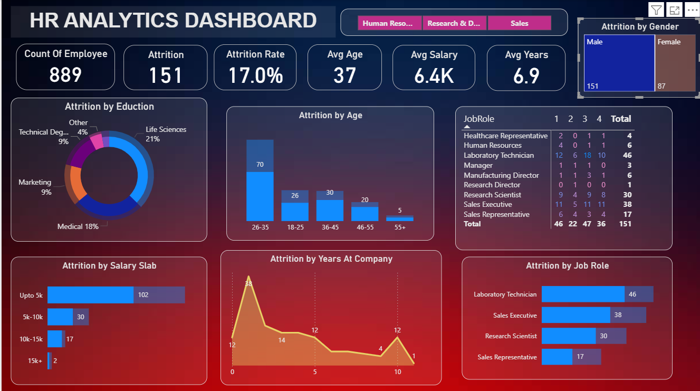

# HR Analytics Power BI Dashboard

An interactive HR Analytics dashboard built in Power BI to analyze employee 
attrition across departments, age groups, salary slabs, education, and tenure.

## Dashboard Preview

## Key Metrics
- Count of Employees: 1,480
- Attrition: 238
- Attrition Rate: 16.1%
- Average Age: 37
- Average Salary: 6.5K
- Average Tenure: 7.0 years

## Features
- Department-wise filtering (Human Resources, Research & Development, Sales)
- Attrition by Education, Age Group, Salary Slab, and Years at Company
- Attrition breakdown by Job Role (Laboratory Technician, Sales Executive, 
  Research Scientist, Sales Representative, etc.)
- Gender-wise attrition comparison
- Interactive slicers and drill-through JobRole matrix

## Key Insights
- Employees aged 26–35 show the highest attrition (116 employees)
- Attrition is highest among those earning up to 5K salary slab (163 employees)
- Employees leave most within their first year at the company
- Laboratory Technician and Sales Executive roles have the highest attrition counts

## Tools Used
- Power BI Desktop
- DAX for calculated measures
- Data modeling and interactive visuals

## How to Use
1. Download `HR_Analytics_Dashboard.pbix`
2. Open in Power BI Desktop
3. Use the department buttons and slicers to explore attrition trends

## About Me
Aspiring Data Analyst / MIS Executive skilled in Excel, SQL, and Power BI.
[LinkedIn](https://linkedin.com/in/om-kshirsagar-data) | [GitHub](https://github.com/kshirsagar-droid)
